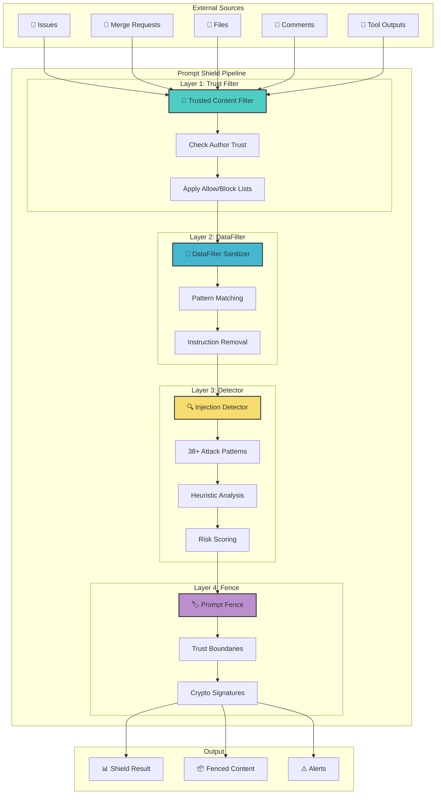
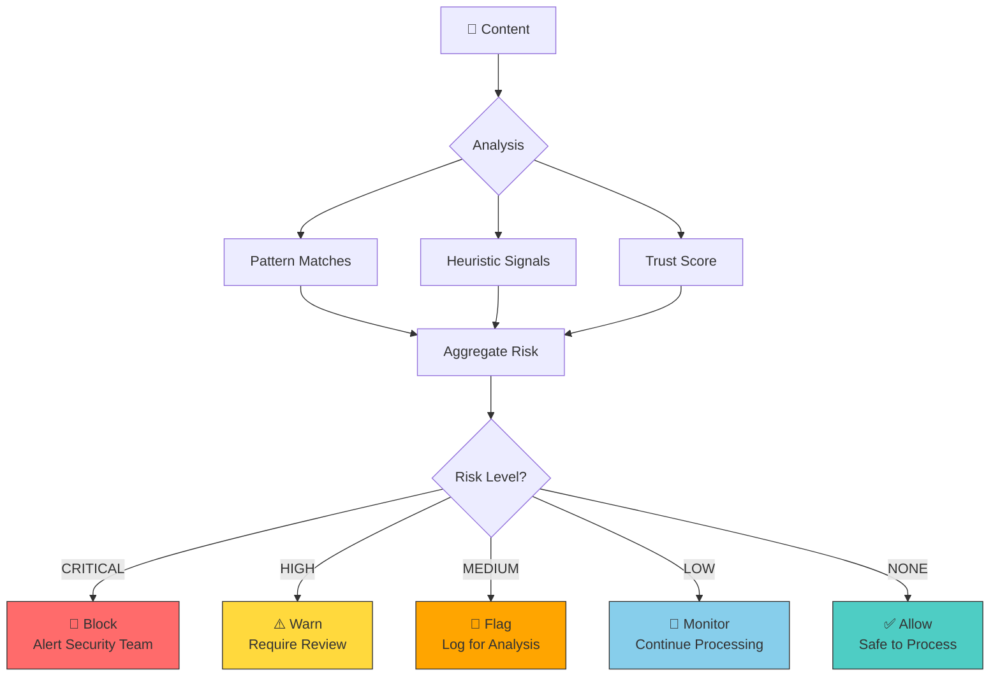
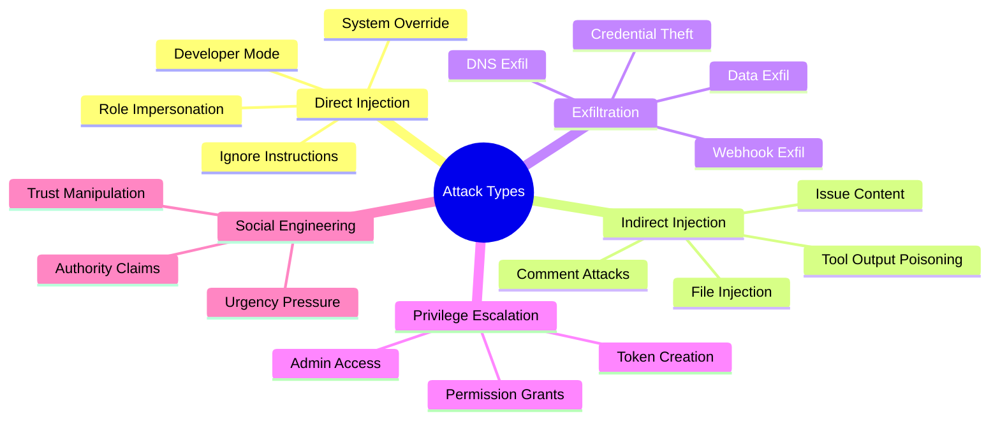
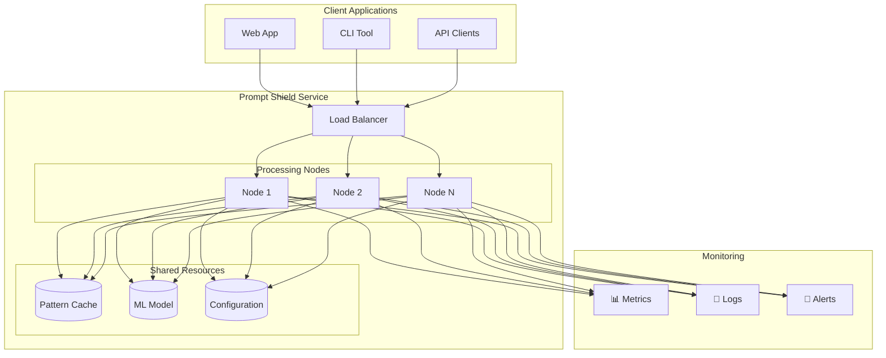
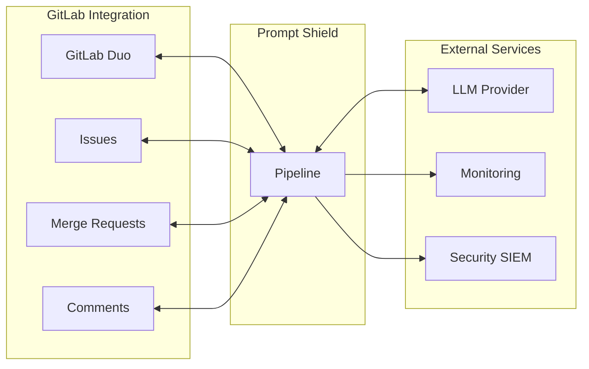

# Prompt Shield Architecture

## System Architecture Diagram

```mermaid
graph TB
    subgraph "External Sources"
        IS[📝 Issues]
        MR[🔀 Merge Requests]
        FC[📄 Files]
        CM[💬 Comments]
        TO[🔧 Tool Outputs]
    end

    subgraph "Prompt Shield Pipeline"
        direction TB
        
        subgraph "Layer 1: Trust Filter"
            TF[🔐 Trusted Content Filter]
            TF1[Check Author Trust]
            TF2[Apply Allow/Block Lists]
        end
        
        subgraph "Layer 2: DataFilter"
            DF[🧹 DataFilter Sanitizer]
            DF1[Pattern Matching]
            DF2[Instruction Removal]
        end
        
        subgraph "Layer 3: Detector"
            DET[🔍 Injection Detector]
            DET1[38+ Attack Patterns]
            DET2[Heuristic Analysis]
            DET3[Risk Scoring]
        end
        
        subgraph "Layer 4: Fence"
            PF[🏷️ Prompt Fence]
            PF1[Trust Boundaries]
            PF2[Crypto Signatures]
        end
    end

    subgraph "Output"
        SR[📊 Shield Result]
        FC2[📦 Fenced Content]
        AL[⚠️ Alerts]
    end

    IS & MR & FC & CM & TO --> TF
    TF --> TF1 --> TF2
    TF2 --> DF
    DF --> DF1 --> DF2
    DF2 --> DET
    DET --> DET1 --> DET2 --> DET3
    DET3 --> PF
    PF --> PF1 --> PF2
    PF2 --> SR & FC2 & AL

    style TF fill:#4ecdc4,stroke:#333,stroke-width:2px
    style DF fill:#45b7d1,stroke:#333,stroke-width:2px
    style DET fill:#f7dc6f,stroke:#333,stroke-width:2px
    style PF fill:#bb8fce,stroke:#333,stroke-width:2px
```

## Layer Responsibilities

```mermaid
flowchart LR
    subgraph L1["🔐 Layer 1"]
        direction TB
        L1T[Trust Filter]
        L1D["WHO can submit content?"]
        L1A["• Check trust levels<br/>• Apply blocklists<br/>• Verify permissions"]
    end
    
    subgraph L2["🧹 Layer 2"]
        direction TB
        L2T[DataFilter]
        L2D["WHAT instructions to remove?"]
        L2A["• Pattern matching<br/>• Sanitize content<br/>• Preserve context"]
    end
    
    subgraph L3["🔍 Layer 3"]
        direction TB
        L3T[Detector]
        L3D["IS this an attack?"]
        L3A["• Detect patterns<br/>• Score risk<br/>• Generate alerts"]
    end
    
    subgraph L4["🏷️ Layer 4"]
        direction TB
        L4T[Prompt Fence]
        L4D["HOW to mark boundaries?"]
        L4A["• Tag trust levels<br/>• Add signatures<br/>• Inject warnings"]
    end
    
    L1 --> L2 --> L3 --> L4
    
    style L1 fill:#4ecdc4
    style L2 fill:#45b7d1
    style L3 fill:#f7dc6f
    style L4 fill:#bb8fce
```

## Risk Assessment Flow

```mermaid
flowchart TB
    Content[📄 Content] --> Analysis{Analysis}
    
    Analysis --> P[Pattern Matches]
    Analysis --> H[Heuristic Signals]
    Analysis --> T[Trust Score]
    
    P & H & T --> Aggregate[Aggregate Risk]
    
    Aggregate --> Risk{Risk Level?}
    
    Risk -->|CRITICAL| Block["🚫 Block<br/>Alert Security Team"]
    Risk -->|HIGH| Warn["⚠️ Warn<br/>Require Review"]
    Risk -->|MEDIUM| Flag["🔶 Flag<br/>Log for Analysis"]
    Risk -->|LOW| Monitor["📝 Monitor<br/>Continue Processing"]
    Risk -->|NONE| Allow["✅ Allow<br/>Safe to Process"]
    
    style Block fill:#ff6b6b,stroke:#333
    style Warn fill:#ffd93d,stroke:#333
    style Flag fill:#ffa500,stroke:#333
    style Monitor fill:#87ceeb,stroke:#333
    style Allow fill:#4ecdc4,stroke:#333
```

## Attack Coverage Matrix

```mermaid
mindmap
    root((Attack Types))
        Direct Injection
            Ignore Instructions
            Role Impersonation
            Developer Mode
            System Override
        Indirect Injection
            Tool Output Poisoning
            Issue Content
            File Injection
            Comment Attacks
        Exfiltration
            Credential Theft
            Data Exfil
            Webhook Exfil
            DNS Exfil
        Privilege Escalation
            Token Creation
            Permission Grants
            Admin Access
        Social Engineering
            Authority Claims
            Urgency Pressure
            Trust Manipulation
```

## Deployment Architecture

```mermaid
flowchart TB
    subgraph "Client Applications"
        WEB[Web App]
        CLI[CLI Tool]
        API[API Clients]
    end
    
    subgraph "Prompt Shield Service"
        LB[Load Balancer]
        
        subgraph "Processing Nodes"
            N1[Node 1]
            N2[Node 2]
            N3[Node N]
        end
        
        subgraph "Shared Resources"
            CACHE[(Pattern Cache)]
            ML[(ML Model)]
            CONFIG[(Configuration)]
        end
    end
    
    subgraph "Monitoring"
        METRICS[📊 Metrics]
        LOGS[📝 Logs]
        ALERTS[🔔 Alerts]
    end
    
    WEB & CLI & API --> LB
    LB --> N1 & N2 & N3
    N1 & N2 & N3 --> CACHE & ML & CONFIG
    N1 & N2 & N3 --> METRICS & LOGS & ALERTS
```

## Integration Points

```mermaid
flowchart LR
    subgraph "GitLab Integration"
        GD[GitLab Duo]
        GI[Issues]
        GMR[Merge Requests]
        GC[Comments]
    end
    
    subgraph "Prompt Shield"
        PS[Pipeline]
    end
    
    subgraph "External Services"
        LLM[LLM Provider]
        MON[Monitoring]
        SEC[Security SIEM]
    end
    
    GD & GI & GMR & GC <--> PS
    PS <--> LLM
    PS --> MON & SEC
```
