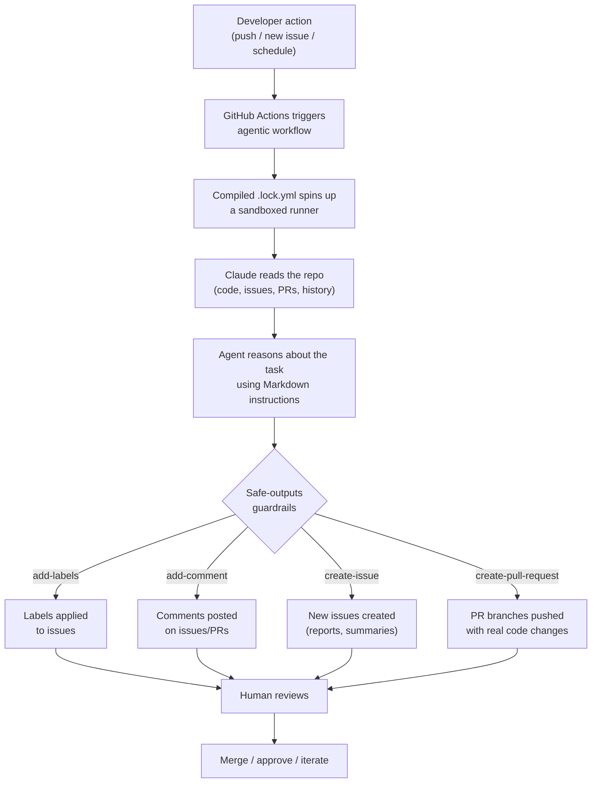

**GitHub Agentic Workflows — First Integration & Test Run on Prompt-Shield**

I just integrated GitHub's new *Agentic Workflows* (currently in technical preview) into the Prompt-Shield repository. Here's a full breakdown of what this is, how it works, and what the agents actually produced on their first run.

---

**What are GitHub Agentic Workflows?**

A new capability from GitHub Next that lets you describe repository automation tasks in plain Markdown, and an AI coding agent executes them inside GitHub Actions. Think of it as CI/CD for tasks that require reasoning — triage, documentation, code quality, testing — things that were difficult or impossible with traditional YAML workflows alone.

Key design principles:
• Workflows are authored as `.md` files in `.github/workflows/` — natural language instructions with a YAML frontmatter for triggers, permissions, and guardrails
• Agents run with *read-only* permissions by default. All write operations (creating PRs, adding labels, commenting) go through a controlled `safe-outputs` mechanism
• Pull requests are *never* auto-merged — humans always review
• Supports multiple AI engines: Copilot, Claude, or OpenAI Codex

Blog post: https://github.blog/ai-and-ml/automate-repository-tasks-with-github-agentic-workflows/

---

**What I set up**

I configured 4 agentic workflows powered by *Claude (Anthropic)* as the AI engine:

| Workflow | Trigger | Purpose |
|---|---|---|
| Issue Triage | New/reopened issues | Auto-classify, label, and comment on issues |
| Documentation Sync | Push to `main` | Detect doc drift and open PRs to fix it |
| Daily Repo Status | Daily schedule | Generate a maintainer status report |
| Test Improvement | Weekly (Monday) | Find coverage gaps and write new tests |

---

**High-level flow**

---

**Test run results — all 4 workflows ran successfully**

*1. Issue Triage (3m 27s)*
I opened a test issue: _"False positive on markdown code blocks"_
The agent:
• Applied labels: `bug`, `detection-pattern`, `priority: medium`
• Left a comment identifying the likely root cause in the detector layer and suggested fixes (recognizing markdown code block delimiters, adjusting confidence scoring)

*2. Daily Repo Status Report (3m 56s)*
Created issue #6: _"[repo status] Daily Report - 2026-02-14"_
Full report with sections covering:
• Activity summary (1 commit, 1 new issue, contributors)
• Detection pattern health (flagged the false positive from issue #5)
• CI/CD status (all green, noted new agentic workflow infrastructure)
• Security posture (stable, no active concerns)
• Action items with prioritized next steps

*3. Documentation Sync (5m 27s, 925K tokens, 26 tool calls)*
Detected that my push adding agentic workflows wasn't reflected in the docs. Created a branch with:
• `README.md` — added an "AI-Powered Repository Automation" section with a table of all 4 workflows (+15 lines)
• `docs/INTEGRATION.md` — added a full "GitHub Agentic Workflows" documentation section (+216 lines)

*4. Continuous Test Improvement (6m 7s)*
Analyzed test coverage, identified that the CLI module (`cli.py`) had zero test coverage. Created a branch with:
• `tests/unit/test_cli.py` — *652 lines* of new tests covering detect commands, trust levels, content types, error handling, JSON output, and edge cases

---

**Quick numbers**

• 4 agentic workflows, all completed successfully
• ~19 minutes total agent compute time
• 2 new branches with real code changes (881 lines added)
• 2 issues created (triage comment + daily report)
• 3 labels auto-applied
• Zero manual intervention required (except reviewing the output)

Actions dashboard: https://github.com/markmishaev76/Prompt-Shield/actions

---

**What's next**

These workflows are now live and will run automatically:
• Every new issue → auto-triaged and labeled by Claude
• Every push to `main` → docs checked for drift
• Every day → status report generated
• Every Monday → test coverage analyzed with a PR for the highest-value missing test

This is "Continuous AI" — background agents that handle the repetitive reasoning tasks that traditional CI/CD can't express.
